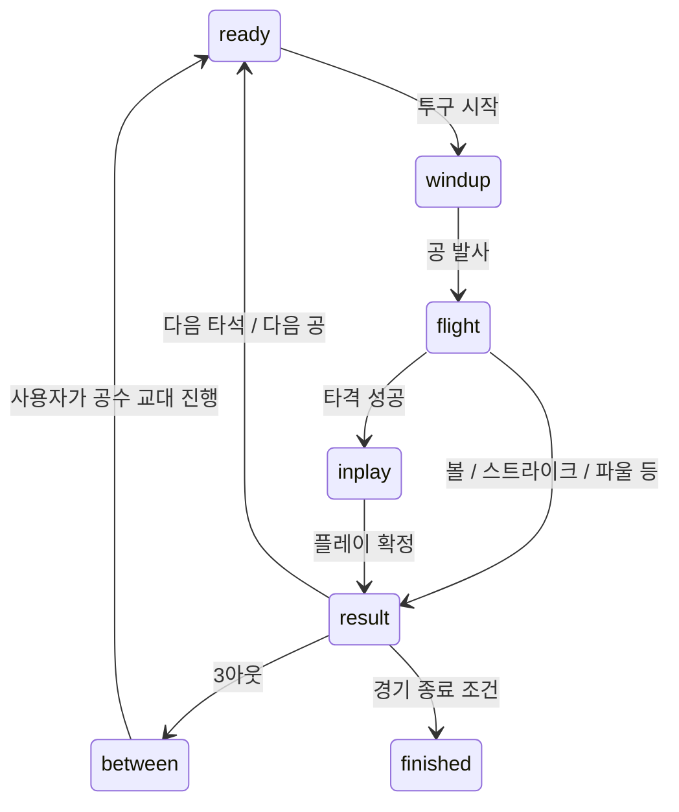

# 코드 지도와 핵심 계약

## 웹 책임 분리

| 파일 | 핵심 이름 | 책임 |
|---|---|---|
| `web/src/main.tsx` | `createRoot` | React 진입점 |
| `web/components/game/DiamondGame.tsx` | `DiamondGame`, `Field`, `AimPad`, `PitchMovementGuide`, `CareerView`, `TrainingView` | 화면, 입력, 설정, 음향, 렌더러 선택 |
| `web/lib/game/engine.ts` | `BaseballEngine`, `GameState`, `Flight`, `LivePlay`, `RunnerTrack`, `Career` | 유일한 게임 규칙·상태 소유자 |
| `web/lib/game/field.ts` | `BaseballField` | Three.js 장면·모델·그림자·카메라, 상태를 읽어 그리기 |
| `web/lib/game/software-field.ts` | `SoftwareField` | WebGL2가 없을 때 Canvas 원근 렌더링 |
| `web/scripts/check-game.mjs` | `check`, `seed`, `finishPlay` | 엔진 회귀 검사와 시드 고정 경기 |
| `web/app/globals.css` | CSS 클래스들 | 게임과 반응형 UI |
| `web/components/ui/` | Radix 기반 작은 래퍼 | 대화상자·선택·슬라이더 등 |

`Field`의 requestAnimationFrame 루프가 `engine.tick(dt)`와 렌더러 `update(dt)`를 호출한다. 프레임 시간은 최대 0.05초로 제한한다. 엔진 `subscribe/getSnapshot`을 React `useSyncExternalStore`가 구독한다. 화면이 규칙을 별도로 계산하면 판정과 애니메이션이 어긋난다.

엔진은 난수 함수를 생성자로 받으므로 회귀 테스트에 고정 seed를 쓸 수 있다. 렌더러는 판정을 확정하는 장소가 아니다. 양쪽 렌더러가 같은 엔진을 사용한다.

`document.modelContext`가 있는 환경에서만 상태 읽기/구종 선택/투구 도구를 등록하는 선택적 코드가 있다. 없으면 즉시 반환하므로 일반 브라우저에 플러그인이나 서버가 필요하지 않다.

## 웹 상태 흐름

`paused`는 별도 플래그다. 투구 클릭은 ready에서만, 타격은 flight에서 한 번만 받는다. result→ready/교대/종료 처리는 `next()`, 이닝 시작은 `continueInning()`이 담당한다.

## 어떤 함수를 바꾸는가

| 문제 | 먼저 확인할 함수 |
|---|---|
| 목표·구속·제구 | `throwAt`, `launch`, `ballistic`, `pitchPosition` |
| 구종 휨·범위 표시 | `PITCHES`, `pitchMovement`, `pitchPosition`, UI `PitchMovementGuide`/`AimPad` |
| 타격 타이밍·결과 | `swing`, `resolvePitch`, `contact` |
| 주루 방향·몸 방향 | `BASES`, `runnerPose`, `playerYaw`, 두 렌더러 |
| 땅볼/플라이 포구 | `liveBall`, `tickLivePlay`, `stepLivePlay` |
| 송구할 곳·포스/태그 | `forcedRunner`, `candidateRunner`, `chooseThrow`, `beginThrow`, `advanceLiveRunners`, `retire` |
| 득점·플레이 종료 | `resolvePlay`, `addRuns`, `next`, `finish` |
| 훈련·저장 | `train`, `draft`, `persist`, `load` |

## 웹 좌표와 주루

좌표 단위는 m, 시간은 초, UI 구속은 km/h이다. 코드의 속도는 필요 시 km/h÷3.6을 사용한다.

| 지점 | X | Y | Z |
|---|---:|---:|---:|
| 홈/베이스 경로 끝 | 0 | 0.12 | 0 |
| 릴리스 | 0.35 | 1.85 | 18.44 |
| 1루 | -19.4 | 0.12 | 19.4 |
| 2루 | 0 | 0.12 | 38.8 |
| 3루 | 19.4 | 0.12 | 19.4 |

`BASES`의 배열 순서는 1루, 2루, 3루, 홈이다. 홈에서 외야(+Z)를 보는 포수 카메라의 화면 오른쪽은 world −X다. 투수 방향 조준판의 좌우와 혼동하지 않는다. 렌더 선수의 전방은 local −Z이므로 `Object3D.lookAt()`만 사용하면 뒤로 달릴 수 있다. `playerYaw()`가 이 차이를 보정한다.

`RunnerTrack.progress`는 0=타석, 1=1루, 2=2루, 3=3루, 4=득점이다. `from`, `target`, `pace`, `delay`, `out`, `scoredAt`과 같이 쓰며 위치는 `runnerPose()`로 얻는다. play의 첫 runner(id 0)는 타자주자다.

플레이 사이에는 `bases:boolean[]`로 줄여 저장하는 한계가 있다. 따라서 한 플레이 안의 시각/판정은 공유하지만 시즌 전체의 개별 주자 신원이 유지되는 것은 아니다.

## 판정 시 주의

- 포스는 타자와 뒤 주자의 연속 점유·아웃 상태에 따라 성립한다. 베이스를 밟았다는 사실만으로 아무 주자나 아웃이 되지 않는다.
- 송구는 특정 대상 `runnerId`, 시작·도착 시각, 수신 수비수의 베이스 도착을 함께 확인한다.
- 포스가 아닌 주자는 베이스 도착 전 실제 접근 위치에서 태그 판정을 받아야 한다. 베이스에 안전하게 선 주자를 늦은 송구로 지우지 않는다.
- 프레임을 포구·착지·송구 도착 사건 경계에서 나눈다. 30/60/144FPS에 따라 접전 판정이 뒤집히지 않도록 관련 검사를 유지한다.
- 플라이 포구는 `catchAt`의 공 높이와 수비수 도착 거리로 결정한다. 잡으면 타자 즉시 아웃, 안 잡으면 지면 접촉 후 진루를 계속한다.
- `resolvePlay()`는 세 번째 아웃과 주자의 `scoredAt`을 비교한다. 포스·플라이·타자의 1루 전 세 번째 아웃에서는 득점을 인정하지 않는다. 현재 모델은 단순한 플레이만 지원한다.

## 투구 궤적과 표시

`ballistic()`은 정해진 시작점·목표점·초기 속력에 도달하는 중력 궤적의 낮은 해를 구한다. `launch()`에서 조준점과 제구 오차가 적용된 실제 도착점을 각각 저장한다.

`pitchPosition(u)`는 기본 포물선에 `sin(πu) × pitchMovement`를 더한다. u=0과 u=1에서 보정이 0이므로 시작/끝을 이동시키지 않는다. 움직임은 실제 회전·항력 해석이 아닌 보정 궤적이다. UI의 가로/세로 cm는 이 보정의 최대 크기다. 커브의 양의 Y 보정은 중력 궤적보다 높은 호를 뜻하며 끝에서는 다시 목표로 내려온다.

`duration`은 물리 계산 시간, `visualDuration`은 조작 난이도에 따른 느린 표시 시간이다. 느린 화면을 보고 구속 공식을 임의로 바꾸지 않는다.

## 저장 경계

키 `diamond-road-career-v1`, schema `version:1`이다. 선수 이름·6능력치·일차·체력·컨디션·스카우트·누적 기록·진로·짧은 일지를 저장한다. 경기의 phase/ball/live/bases 전체를 저장하지 않는다. origin이 다르면 저장도 다르다.

## Unity 패키지의 별도 구조

`PitchInputReader` → `PitchingController` → `PitchTrajectory`/`PitchBallMotor`, 목표 변환은 `PitchAimPlane`, 상태 표시는 `PitchHud`다. `Editor/`의 두 파일은 생성·검사 도구다.

Unity는 릴리스 (0,1.8,0), 목표면 중심 (0,1.05,18), 카메라 (0,2.2,-4)이며 공은 +Z로 간다. 웹은 홈을 z=0으로 두고 투수가 −Z로 던진다. 거리와 높이도 다르므로 단순 부호 반전으로 동일 설정이 되지 않는다. Unity 통합 작업을 시작할 때 공통 기준을 결정하고 씬·카메라·목표·수비·주루를 함께 변환/검사해야 한다.
